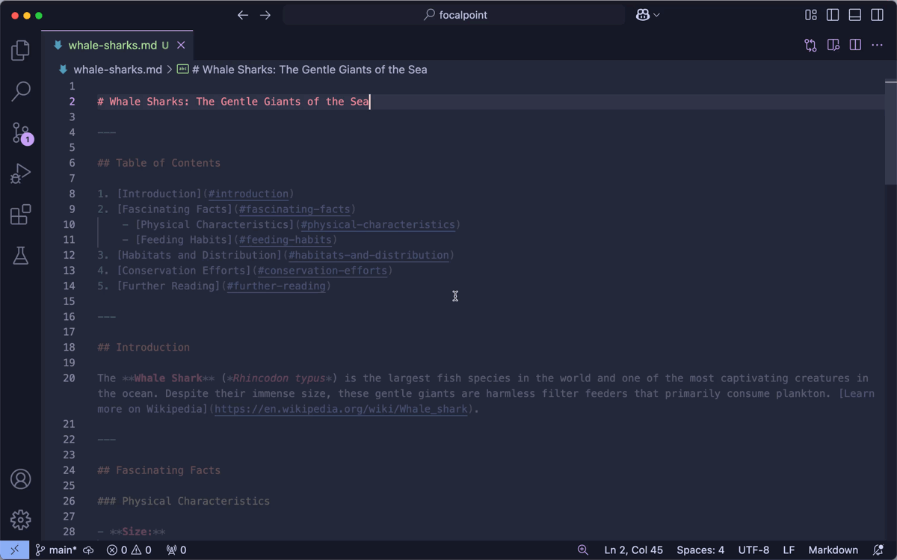

# CodeGlow for VS Code

<div align="center">

[](https://marketplace.visualstudio.com/items?itemName=wescottsharples.codeglow)

[](https://marketplace.visualstudio.com/items?itemName=wescottsharples.codeglow)
[](https://marketplace.visualstudio.com/items?itemName=wescottsharples.codeglow)
[](https://marketplace.visualstudio.com/items?itemName=wescottsharples.codeglow)
[](https://opensource.org/licenses/MIT)

**Illuminate your focus, dim the distractions.**

</div>

## Features

CodeGlow helps you focus on what matters by intelligently dimming inactive regions of your code. Like a spotlight on your active code block, it keeps you in the zone while maintaining context awareness.

### Features

- **Multiple Block Detection Modes**:
  - **Paragraph Mode** (default): Automatically detects and highlights text blocks between blank lines
  - **Symbol Mode**: Uses VS Code's language server to focus on semantic blocks (functions, classes, etc.)
  - **Delimiter Mode**: Uses custom regular expressions to define block boundaries (great for custom file formats)
- **Smooth Transitions**: Seamlessly updates as you move through your code
- **Smart Scroll Handling**: Temporarily removes dimming while scrolling for better readability

### Customizable Experience

- **Adjustable Dimming**: Fine-tune the opacity of inactive regions (0.0 to 1.0)
- **Buffer Control**: Set how many lines to process above and below the visible area
- **Multiple Detection Modes**: Choose between paragraph-based, symbol-based, or custom delimiter-based detection
- **Custom Block Delimiters**: Define your own block boundaries using regular expressions
- **Scroll Behavior**: Configure how the extension handles scrolling and transitions
- **Performance Optimized**: Only processes visible code, making it efficient even with large files

### Block Detection Modes

#### Paragraph Mode (Default)
Detects blocks based on empty lines. This is ideal for most programming languages and markdown files.

#### Symbol Mode
Uses VS Code's language server to detect semantic blocks like functions and classes. Best for structured code.

#### Delimiter Mode
Define custom block boundaries using regular expressions. Perfect for files with special formatting or comment-based sections.

Example configuration for files with "; --------" style delimiters:
```json
{
  "codeglow.blockDetection": "delimiters",
  "codeglow.blockDelimiters.begin": "^(;\\s*)+[-]+\\s*$"
}
```

You can also set different patterns for block start and end:
```json
{
  "codeglow.blockDetection": "delimiters",
  "codeglow.blockDelimiters.begin": "/\\*\\s*BEGIN BLOCK\\s*\\*/",
  "codeglow.blockDelimiters.end": "/\\*\\s*END BLOCK\\s*\\*/"
}
```

### Zen Mode Integration
CodeGlow can now be configured to only activate when VS Code's Zen Mode is enabled. This is perfect for users who want to maintain maximum focus during dedicated writing or coding sessions. To use this feature:

1. Enable the setting: `codeglow.onlyInZenMode`
2. Enter Zen Mode in VS Code (Cmd/Ctrl+K Z)
3. CodeGlow will automatically activate and deactivate with Zen Mode

## Installation

1. Open VS Code
2. Press `Ctrl+P` (or `Cmd+P` on macOS)
3. Type `ext install wescottsharples.codeglow`
4. Press Enter

## Usage

1. Open any code file
2. Move your cursor to a code block
3. The current block stays at full opacity while surrounding code is dimmed
4. Toggle the effect with:
   - Command Palette (`Ctrl+Shift+P` or `Cmd+Shift+P`): "CodeGlow: Toggle Effect"
   - Or set up your own keyboard shortcut

## Configuration

CodeGlow can be customized through VS Code's settings:

\`\`\`jsonc
{
  // Opacity level for dimmed text (0.0 to 1.0)
  "codeglow.dimOpacity": 0.3,

  // Use paragraph mode (text between blank lines)
  "codeglow.paragraphMode": true,

  // Choose focus detection method
  "codeglow.blockDetection": "paragraph", // or "documentSymbols"

  // Number of buffer lines to process
  "codeglow.bufferLines": 50,

  // Enable/disable dimming removal while scrolling
  "codeglow.disableWhileScrolling": true,

  // Delay before reapplying dimming after scrolling (ms)
  "codeglow.scrollDebounceDelay": 250,

  // Enable debug logging
  "codeglow.enableLogging": false,

  // Enable CodeGlow only in Zen Mode
  "codeglow.onlyInZenMode": true,

  // Enable CodeGlow only for specific languages
  "codeglow.enabledLanguages": ["*"] // Use specific language IDs like ["markdown", "typescript"]
}
\`\`\`

## Performance

CodeGlow is designed to be lightweight and efficient:
- Lazy loading: Only activates for specified file types
- Smart language support: Configure exactly which file types should use CodeGlow
- Only processes visible code
- Minimal CPU usage
- Low memory footprint
- Optimized for large files
- Smart scroll handling to maintain performance

### Supported File Types

CodeGlow supports many common file types out of the box:
- Markdown (`.md`)
- TypeScript/JavaScript (`.ts`, `.js`, `.tsx`, `.jsx`)
- Python (`.py`)
- Java (`.java`)
- C/C++ (`.c`, `.cpp`)
- C# (`.cs`)
- Go (`.go`)
- Rust (`.rs`)
- PHP (`.php`)
- Ruby (`.rb`)
- Web Technologies (`.html`, `.css`, `.scss`, `.less`)
- Data Formats (`.json`, `.yaml`, `.xml`)
- Modern Frameworks (`.vue`, `.svelte`)
- SQL (`.sql`)
- Plain Text (`.txt`)

To enable CodeGlow for specific file types only:
1. Open VS Code Settings
2. Search for "CodeGlow: Enabled Languages"
3. Add the language IDs you want to enable (e.g., `["markdown", "typescript"]`)
4. Or use `["*"]` to enable for all supported file types

Note: The extension only loads when you open supported file types or explicitly invoke CodeGlow commands, ensuring minimal impact on VS Code's performance.

## Contributing

Contributions are welcome! Please feel free to submit a Pull Request. For major changes:
1. Open an issue first to discuss what you would like to change
2. Make sure to update tests as appropriate
3. Follow the existing code style

## License

[MIT](LICENSE) © Wescott Sharples

## Acknowledgements

Inspired by [Limelight.vim](https://github.com/junegunn/limelight.vim) by Junegunn Choi. We aim to bring the same focused coding experience to VS Code users.

## Release Notes

### 0.0.1

- Initial release
- Basic dimming functionality
- Paragraph and symbol-based detection modes
- Configurable settings
- Performance optimizations

## Settings

* `codeglow.dimOpacity`: Opacity level for dimmed text (0.0 to 1.0)
* `codeglow.paragraphMode`: When enabled, highlights the entire paragraph containing the cursor instead of just the current line
* `codeglow.blockDetection`: Choose how CodeGlow determines the focused block: by language server symbols or by paragraphs
* `codeglow.bufferLines`: Number of additional lines to buffer above and below the visible range
* `codeglow.disableWhileScrolling`: When enabled, temporarily removes dimming effect while scrolling
* `codeglow.scrollDebounceDelay`: Delay in milliseconds before reapplying decorations after scrolling stops
* `codeglow.scrollVelocityThreshold`: Minimum scroll velocity to trigger dimming removal
* `codeglow.enableLogging`: Enable debug logging to the CodeGlow output channel
* `codeglow.onlyInZenMode`: When enabled, CodeGlow will only be active when VS Code's Zen Mode is enabled
* `codeglow.enabledLanguages`: Choose which languages should use CodeGlow
